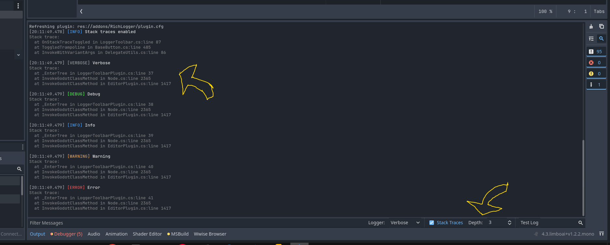

# Godot RichLogger C#
A feature-rich logging utility addon for Godot 4.x C# projects that enhances the default Godot output panel with additional functionality.



## Features
- **Enhanced Output Formatting** - Format your logs with rich text, colors, and styling
- **Log Filtering** - Filter logs by log level directly from the Godot editor
- **Integrated Toolbar** - Convenient controls added to the output panel
- **Log Levels** - Standard log levels (Debug, Info, Warning, Error) with visual differentiation
- **Easy Integration** - Simple API for logging from anywhere in your Godot C# code

## Installation
1. Download or clone this repository
2. Copy the `addons/RichLogger` folder to your Godot project's `addons` folder
3. Compile project
4. Enable the plugin in Godot via Project > Project Settings > Plugins

## Usage
### Basic Logging
``` csharp
Logger.Debug("This is a debug message");
Logger.Info("This is an information message");
Logger.Warning("This is a warning message");
Logger.Error("This is an error message");
```
### Formatted Logging
``` csharp
// Use BBCode for rich text formatting
Logger.Info("[b]Bold text[/b] and [i]italic text[/i]");
Logger.Debug("Player position: [color=yellow]" + player.Position + "[/color]");
```
### Using the Toolbar
The plugin adds a toolbar to the output panel that allows you to:
- Filter logs by level
- Enable/disable stack traces and set their depth

## Contributing
Contributions are welcome! Please feel free to submit a Pull Request.

## License
This plugin is released under the MIT License. See the LICENSE file for details.  
  
_Made with ❤️ for the Godot community_
